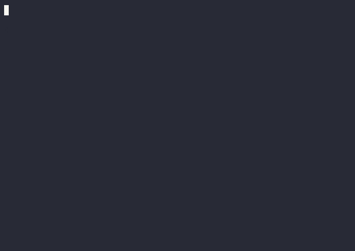

# A simple calculator interpreter in Rust
This is a beginner-friendly implementation for a simple calculator. Its simple enough that it should be easy to understand, but its fully-featured enough that it showcases some concepts that wouldn't necessarily be found in other beginner tutorials. It's also heavily commented, and uses a minimal amount of dependencies. All the important bits are hand-coded.

It features a nice prompt, a robust tokenizer, a pratt parser, a simple runtime, and nice error handling and reporting. It supports basic arithmetic with correct operator and parenthesis precedence. The code should be clear enough to make it simple to add new features like exponents, trigonometric functions, etc.



# Foreword: Compiler Vs Interpreter
A compiler treats the source as something to translate to native code, *which can then be executed*. An interpreter treats the source as as instructions to be directly executed (broadly speaking). In other words:
* Compilers output programs.
* Interpreters output results.

We want our calculator to receive an expression from the user and output the result, so it's an interpreter. 

Keep in mind that compilers and interpreters share a lot of similarities in their implementation. They target different goals, but they have a lot in common, so knowing how to build an interpreter is a good way to start building compilers.

# Overview
We can divide the parts required for our interpreter like so:
1. Tokenizer (also called lexer or scanner).
2. Parser.
3. Runtime.

## Tokenizer
The tokenizer's job is to take the input text and transform it into a list of tokens. A token is a value that has a *specific meaning*. 

For example, let's analyze the following arithmetic expression:
```
5 + 6
^ ^ ^
| | └- Number
| └- Plus
└- Number
```
So the tokenized sequence would be
```
[Number, Plus, Number]
```

The goal of the tokenizer is to *recognize* the different parts of the input string to make it easier for the parser to construct an a syntax tree.

## Parser
The parser's job is to take a list of tokens and transform it into a *syntax tree*. A *syntax tree* is a tree datastructure that represents the syntax of your language in a structured way.

For example, let's take the previous list of tokens: `[Number, Plus, Number]`. The syntax tree would be something like:
```
Plus(Number(5), Number(6))
```
which is equivalent to
```
  +
 / \
5   6
```

## Runtime
The runtime is the part of the interpreter that *evaluates* the expressions. In a more complex interpreter, there might be some other stages between the parser and the runtime, but for our purposes, the runtime will directly evaluate the syntax tree.

So, given the above syntax tree `Plus(Number(5), Number(6))`, the runtime would evaluate it to `11` (because `5 + 6 = 11`).

# Let's start implementing!
As always, everything is in the details, and the implementation will reveal a number of complexities we have to deal with. I'll do my best to explain those along the way.

The source code is divided into four files that **should be read in order**:
1. [`input.rs`](src/input.rs)
2. [`tokenizer.rs`](src/tokenizer.rs)
3. [`parser.rs`](src/parser.rs)
4. [`runtime.rs`](src/runtime.rs)
5. [`main.rs`](src/main.rs)

The first file (input) implements a prompt so that the user can enter the expressions. The next three files (tokenizer, parser and runtime) implement the concepts we saw in the overview. The last file (main) puts everything together.
